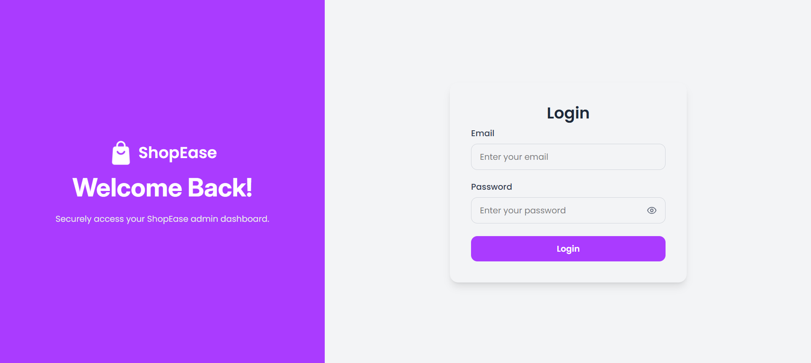
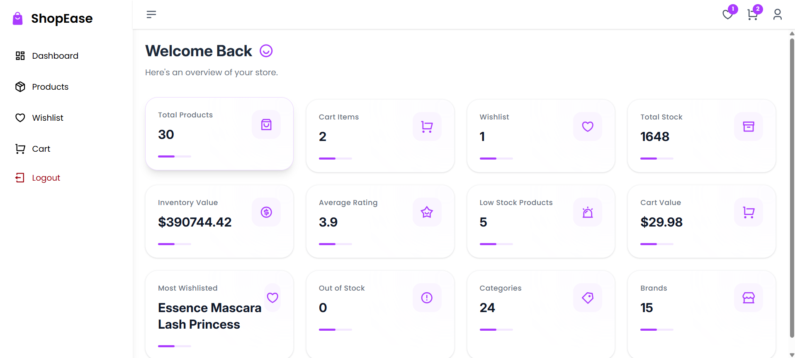
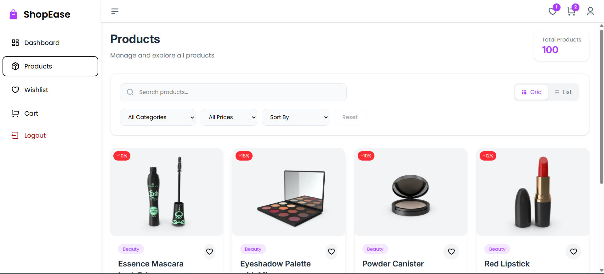
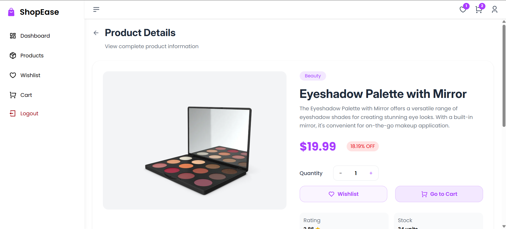
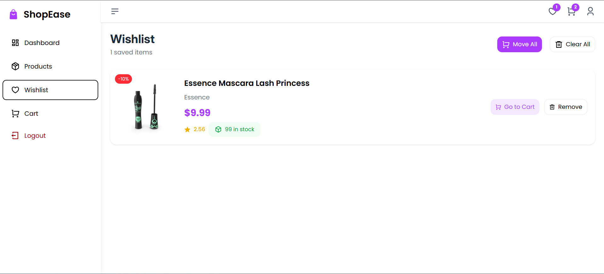
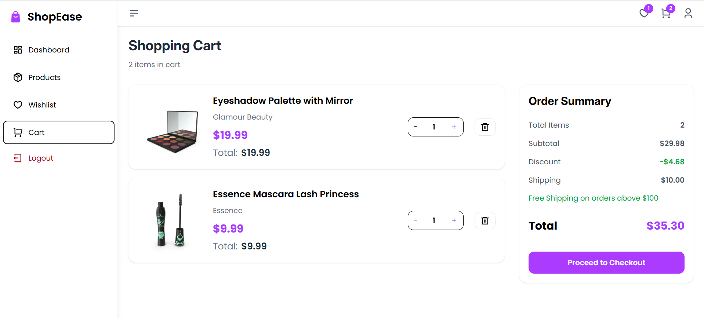
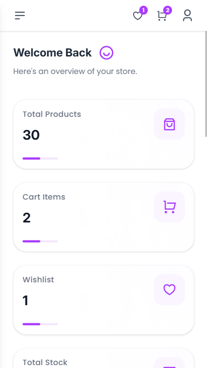

# 🛒 ShopEase - Ecommerce Product Management System

A modern, responsive ecommerce product management dashboard built with **React + TypeScript + Vite**.  
The application provides complete product management features including product browsing, filtering, sorting, pagination, wishlist management, cart functionality, dashboard analytics, and optimized API data fetching.

Designed with a focus on **clean architecture, reusable components, performance optimization, and modern React practices**.

---

## 🚀 Live Demo

https://shopease-ecommerce-8d2f.onrender.com/

---

## 📸 Screenshots















---

# ✨ Features

## 📊 Dashboard Analytics

- Store overview dashboard
- Total products count
- Total stock calculation
- Inventory value calculation
- Average product rating
- Low stock product tracking
- Out of stock products
- Cart analytics
- Wishlist analytics
- Category and brand statistics
- Skeleton loading UI
- API error handling

---

# 🛍 Product Management

## Product Listing

- Fetch products from API
- Responsive grid/list view
- Product cards
- Product details page
- Dynamic routing
- Product information display

## Product Filtering

- Search products
- Category filtering
- Price range filtering
- Sorting options:
  - Price Low to High
  - Price High to Low
  - Rating
  - Name

## Pagination

- Client-side pagination
- Dynamic page navigation
- Optimized product rendering

---

# ❤️ Wishlist Features

- Add products to wishlist
- Remove products from wishlist
- Persistent wishlist storage
- Move single wishlist item to cart
- Move all wishlist items to cart
- Clear wishlist
- Wishlist empty state UI

---

# 🛒 Cart Features

- Add products to cart
- Remove products from cart
- Update quantity
- Calculate total cart value
- Prevent duplicate cart items
- Move wishlist items to cart
- Persistent cart state
- Redirect users to cart after adding items

---

# 🔥 React Features Implemented

## TanStack React Query

Implemented **TanStack React Query** for server state management.

Used for:

- Product fetching
- Product details fetching
- Dashboard data fetching
- Category fetching

Benefits:

- Automatic caching
- Background refetching
- Loading states
- Error handling
- Reduced unnecessary API requests

---

## Zustand State Management

Implemented Zustand for global client state management.

Used for:

- Cart management
- Wishlist management

Features:

- Lightweight state management
- Persistent storage using localStorage
- Global state sharing without prop drilling

---

# 🎨 UI / UX Features

- Fully responsive design
- Mobile filter drawer
- Skeleton loading states
- Empty state components
- Toast notifications
- Smooth transitions
- Modern card-based UI
- Responsive layouts
- Adaptive components

---

# 🌐 API Integration

This project uses **DummyJSON API** as a mock REST API service for fetching product data.

Implemented API operations:

- Fetch products
- Fetch product details by ID
- Fetch product categories
- Product data handling

The frontend handles:

- API state management using TanStack React Query
- Loading states
- Error handling
- Data caching
- Optimized API requests

---

# 🧰 Tech Stack

## Frontend

- React.js
- TypeScript
- Vite
- React Router DOM
- Tailwind CSS

## State Management

- Zustand
- Zustand Persist Middleware

## Server State Management

- TanStack React Query

## UI Libraries

- React Icons
- React Hot Toast
- React Loading Skeleton

## API & Data Handling

- DummyJSON REST API
- Axios
- REST API integration
- Client-side filtering and pagination

## Development Tools

- ESLint
- Git
- GitHub

---

# 📁 Project Structure

```
src
│
├── components
│   ├── ProductCard
│   ├── Filters
│   ├── StatCard
│   ├── EmptyState
│   └── Skeleton Components
│
├── pages
│   ├── Dashboard
│   ├── Products
│   ├── ProductDetail
│   ├── Cart
│   └── Wishlist
│
├── services
│   ├── api.ts
│   ├── productService.ts
│   └── dashboardService.ts
│
├── store
│   ├── cartStore.ts
│   └── wishlistStore.ts
│
├── types
│   └── product.ts
│
└── main.tsx
```

---

# ⚡ Performance Optimizations

Implemented:

- React Query caching
- Query-based API management
- Debounced search
- Conditional rendering
- Optimized component rendering
- Skeleton loaders
- Efficient state updates

---

# 🔐 Error Handling

Implemented:

- API failure handling
- React Query error states
- Empty data handling
- Loading states
- User feedback using toast notifications

---

# 📱 Responsive Design

Supported devices:

✅ Desktop  
✅ Tablet  
✅ Mobile

Implemented:

- Responsive grids
- Mobile bottom filter button
- Adaptive layouts
- Mobile-friendly product cards

---

# 📦 Installation & Setup

Follow the steps below to run this project locally.

## Prerequisites

Make sure you have installed:

- Node.js (v18 or above)
- npm or yarn
- Git

## Clone Repository

```bash
git clone <repository-url>
```

Navigate into the project:

```bash
cd shopease
```

## Install Dependencies

Using npm:

```bash
npm install
```

or using yarn:

```bash
yarn install
```

## Environment Variables

Create a `.env` file in the root directory:

```env
VITE_API_URL=https://dummyjson.com
```

## Run Development Server

```bash
npm run dev
```

Application will run at:

```
http://localhost:5173
```

## Build Production

```bash
npm run build
```

## Preview Production Build

```bash
npm run preview
```

## Available Scripts

| Command         | Description              |
| --------------- | ------------------------ |
| npm run dev     | Start development server |
| npm run build   | Create production build  |
| npm run preview | Preview production build |
| npm run lint    | Run ESLint checks        |

---

# 🌱 Data Handling Approach

Since DummyJSON is used as a mock API, advanced filtering, sorting, and pagination logic are implemented on the frontend after fetching product data.

In a production application, these operations would typically be handled through backend APIs with database queries and server-side pagination.

---

# 🔮 Future Improvements

- Authentication & Authorization
- JWT based login system
- Admin roles and permissions
- Product CRUD operations
- Backend API integration
- Database integration
- Payment gateway
- Order management
- Real-time notifications

---

# 🧑‍💻 Author

**Mansi Kamble**

MERN Stack Developer

Skills:

- React.js
- TypeScript
- Node.js
- Express.js
- MongoDB
- Next.js
- Zustand
- TanStack React Query

---

## ⭐ License

This project is created for learning and portfolio purposes.
